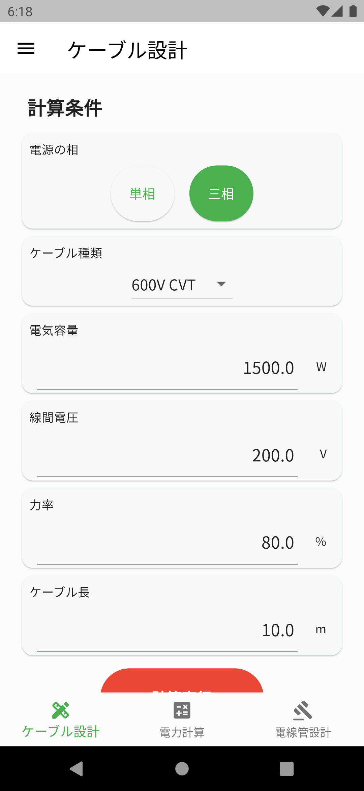

# Electricity Calculator

  

Electricity Calculator is mobile/web app for all electrical engineer.

This is a calculator when you want to calculate cable size, voltage drop, power, and conduit size in electrical equipment design work or electrical work site.

## Getting Started

For android app

For ios app

(Experimental) For web app (w/ Firebase hosting)

[web](https://ewacdj-3936b.web.app/)

## Features

- Select the cable size based on the electric capacity, voltage, and power factor.
- Calculate voltage drop and power loss from the selected cable size and length.
- Calculate power value (apparent, effective, invalid) and sinφ from voltage, current, and power factor.
- Select a conduit size from the selected cable.
- Manage the wiring list.

## How to use

You can check how to use to click [here](https://snova301.github.io/AppService/elec_calculator/home.html).

## Source Code

This source code does not contain cable data, so you need to get cable data such as cable impedance.

※Google Play および Google Play ロゴは、Google LLC の商標です。

※Apple、Apple logo、App Store は米国およびその他の国で登録された Apple Inc.の商標です。
